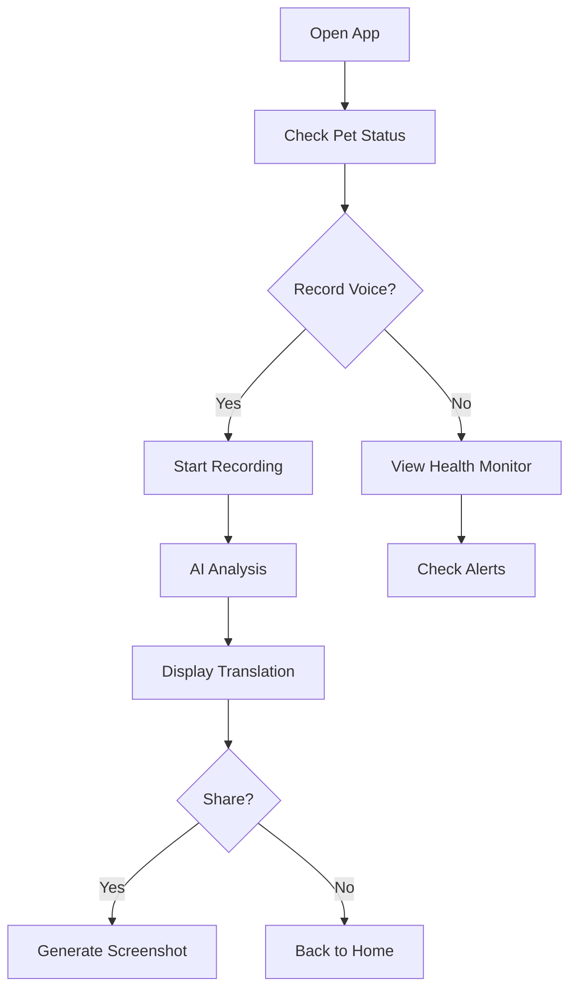

## 1. Product Overview
PawSync Pro 是一款基于多模态AI（声纹+视觉+大模型）的宠物共情、健康守护与互动陪伴终端应用。通过声纹识别、姿态估计等技术，实现宠物情绪翻译、健康预警和智能陪伴，打造人宠沟通的桥梁。

## 2. Core Features

### 2.1 User Roles
| Role | Registration Method | Core Permissions |
|------|---------------------|------------------|
| Normal User | Email/Phone/Social | Basic interaction, emotion translation |
| Pro User | Subscription | Health monitoring, advanced features |

### 2.2 Feature Module
1. **Home Dashboard**: Real-time pet status, quick actions
2. **AI Translator**: Voice emotion analysis, fun translation
3. **Health Guardian**: Vital signs monitoring, anomaly detection
4. **Pet Profile**: Pet ID management, data history
5. **Settings**: Privacy controls, subscription management

### 2.3 Page Details
| Page Name | Module Name | Feature description |
|-----------|-------------|---------------------|
| Home | Status Card | Real-time emotion indicator, health score |
| Home | Quick Actions | Record voice, take photo, view history |
| Translator | Voice Recorder | Record and analyze pet sounds |
| Translator | Translation Display | AI-generated emotion translation |
| Translator | Share | Screenshot and social share |
| Health | Monitoring Panel | Continuous health metrics |
| Health | Alert History | Past anomaly events |
| Profile | Pet Info | Name, breed, age, avatar |
| Profile | Data Timeline | Activity and health history |
| Settings | Privacy | Audio/video permission controls |
| Settings | Subscription | Pro features toggle |

## 3. Core Process
User opens app → Views pet status → Records voice/photo → AI analyzes → Shows emotion/health results → User can share or save

## 4. User Interface Design
### 4.1 Design Style
- Primary Color: Warm gradient (orange → peach) - friendly, caring
- Secondary Color: Soft teal - calm, trustworthy
- Button Style: Rounded corners, subtle shadow, smooth transitions
- Font: Playful yet clean sans-serif (e.g., Poppins)
- Layout: Card-based, flowing, with organic shapes
- Icons: Rounded, cute, pet-themed

### 4.2 Page Design Overview
| Page Name | Module Name | UI Elements |
|-----------|-------------|-------------|
| Home | Header | Pet avatar, greeting, current mood emoji |
| Home | Status Card | Circular health meter, emotion tag, last activity |
| Translator | Recorder | Large circular button with wave animation |
| Translator | Result | Speech bubble with translation text, emotion icon |
| Health | Timeline | Horizontal scroll of daily health snapshots |
| Health | Alert Card | Warning indicators with severity levels |

### 4.3 Responsiveness
- Mobile-first design with touch-optimized controls
- Responsive card layout adapting to screen sizes
- Swipe gestures for navigation between sections

### 4.4 Accessibility
- High contrast mode support
- VoiceOver/Screen reader compatible
- Adjustable text sizes