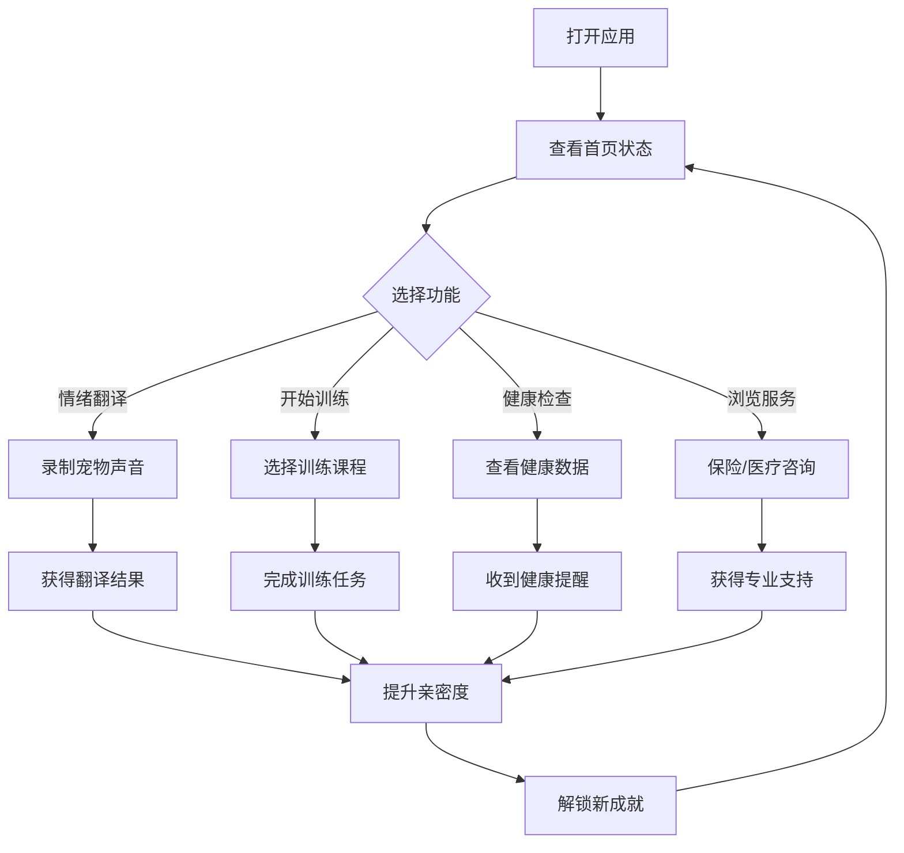

## 1. Product Overview
PawSync Pro 2.0 是一款基于 AI 技术的宠物情感翻译与健康守护应用，专为宠物主人打造温暖、贴心的数字化陪伴体验。
- 通过 Warm Tech 设计语言实现从「安防监控」到「温暖陪伴」的体验升级，提供全方位的宠物训练、保险、医疗咨询等专业服务
- 建立数据壁垒和用户粘性，打造集情感、健康、训练、保障于一体的完整宠物生态闭环

## 2. Core Features

### 2.1 User Roles
| Role | Registration Method | Core Permissions |
|------|---------------------|------------------|
| Pet Owner | Email/Social login | Full access to all features, pet profile management |
| Premium User | Subscription | Advanced training, premium insurance plans, priority medical support |

### 2.2 Feature Module
1. **Home Dashboard**: 亲密度展示、快速功能入口、健康趋势、守护模式
2. **Emotion Translator**: AI 语音分析、情绪翻译结果、分享功能
3. **Training Center**: 课程分类、进度追踪、训练记录、成就徽章
4. **Health Guardian**: 健康监测、异常提醒、历史记录
5. **Services Hub**: 保险方案、医疗咨询、预约管理
6. **Profile**: 宠物信息、个人设置、成就系统

### 2.3 Page Details
| Page Name | Module Name | Feature description |
|-----------|-------------|---------------------|
| Home Dashboard | Hero Section | 渐变色背景、动态亲密度环形进度、实时数据展示 |
| Home Dashboard | Feature Cards | 悬浮卡片、渐变边框、微交互动画、悬停放大效果 |
| Home Dashboard | Health Trend | 平滑图表动画、数据点高亮、趋势指示 |
| Emotion Translator | Voice Recorder | 波纹动画、呼吸效果、录制状态指示 |
| Emotion Translator | Result Card | 渐变弹窗、情绪图标动画、文字逐字显示 |
| Training Center | Course Cards | 进度条动画、难度指示器、Premium 标识、完成状态 |
| Services Hub | Insurance Plans | 价格动画展示、保障项勾选动画、热门方案高亮 |
| Services Hub | Medical Consultation | 症状选择器、AI 诊断流、结果卡片展开动画 |
| Profile | Achievement Gallery | 徽章解锁动画、悬停放大、时间线展示 |

## 3. Core Process
用户打开应用 → 查看首页亲密度和宠物状态 → 选择核心功能（翻译/训练/健康）→ 完成交互获得反馈 → 提升亲密度解锁成就 → 浏览服务获得专业支持

## 4. User Interface Design
### 4.1 Design Style
- **设计理念**: Warm Tech - 温暖科技，从「安防监控」到「陪伴守护」
- **主色调**: 橙色渐变 (#FF6B00 → #FFB473)，传递温暖与活力
- **辅助色**: 清新蓝 (#0E9CE5)、成功绿 (#10B981)、警告黄 (#F59E0B)、紫 (#8B5CF6)
- **按钮风格**: 圆角 16px，渐变背景，悬停上浮 4px，阴影增强，微缩放动画
- **字体**: 标题用圆润无衬线字体（Poppins），正文用清晰易读的系统字体，层级分明
- **布局风格**: 卡片式布局，柔和圆角 (12-24px)，充足留白，微妙阴影
- **图标风格**: Lucide 图标，统一线宽 2px，圆角端点，自然亲切
- **动效风格**: 平滑的入场动画、微交互动画、呼吸效果、弹性过渡

### 4.2 Page Design Overview
| Page Name | Module Name | UI Elements |
|-----------|-------------|-------------|
| Home Dashboard | Hero Header | 暖橙色渐变背景，毛玻璃效果，亲密度环形进度（动画加载），徽章展示，积分条 |
| Home Dashboard | Quick Actions | 2x2 网格布局，渐变背景卡，图标居中，悬停缩放，阴影加深 |
| Home Dashboard | Feature Cards | 垂直列表，左侧彩色边条，右侧 Chevron，悬停上移 +2px，背景色淡变 |
| Home Dashboard | Health Trend | 白色背景卡，图表区域微透明渐变，柱状图动画入场，悬停数据点放大 |
| Home Dashboard | Guardian Mode | 渐变开关，脉冲动画指示器，状态文字 |
| Emotion Translator | Recorder | 大圆形按钮，外圈波纹，内圈呼吸，点击缩放反馈 |
| Emotion Translator | Result | 气泡形状卡片，情绪图标动画，文字逐行淡入，分享按钮 |
| Training Center | Header | 紫色渐变，统计卡，连续天数火焰图标 |
| Training Center | Filter | 横向滚动标签，选中高亮渐变，圆角胶囊 |
| Training Center | Course List | 卡片堆叠，进度条动画，星级评分，锁图标 |
| Services Hub | Main Services | 卡片网格，双色调渐变，图标居中，热门角标 |
| Services Hub | Insurance | 价格展示卡，保障项列表，勾选动画，CTA 按钮 |
| Services Hub | Medical | 症状选择卡，AI 诊断流，结果展开动画 |
| Profile | Header | 头像卡片，统计数字，背景渐变 |
| Profile | Achievements | 网格布局，已解锁/锁定状态，悬停放大 1.1 倍 |

### 4.3 Responsiveness
- 移动端优先设计 (360-430px 宽度优化)
- 触摸友好的点击区域 (≥44x44px)
- 响应式字体缩放 (clamp() 函数)
- 弹性布局适配各种屏幕尺寸
- 横屏模式优化布局

### 4.4 Micro-interactions & Animations
- **页面加载**: Staggered 入场动画 (0-300ms delay)
- **卡片悬停**: Y 轴 -2px，阴影加深，边框发光
- **按钮交互**: 按下缩放 0.97，释放回弹，波纹效果
- **进度动画**: 环形进度从 0 到目标值，时长 1.5s，ease-out
- **列表滚动**: 新项目从底部滑入，fade + translateY
- **成就解锁**: 缩放 + 旋转 + 金色闪光效果
- **图表数据**: 柱状图从底部生长，数据点脉冲
- **导航切换**: 页面淡入淡出，Tab 图标缩放高亮
