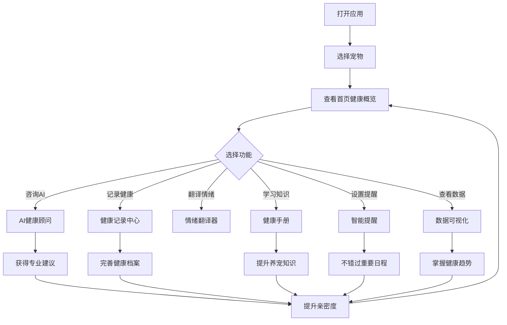

## 1. Product Overview

PawSync Pro 3.0 - AI驱动的全方位宠物健康管家
- 从情感翻译到全生命周期健康管理的跃迁式升级
- 为每一位毛孩子建立专属健康档案，提供AI智能顾问、多媒体记录、专业手册、智能提醒、多宠物管理、数据可视化六大核心能力
- 目标：成为养宠家庭的首选健康管理工具，建立数据壁垒和用户粘性

## 2. Core Features

### 2.1 User Roles
| Role | Registration Method | Core Permissions |
|------|---------------------|------------------|
| Pet Owner | Email/Social login | Full access to all features, pet profile management |
| Premium User | Subscription | Advanced AI reports, unlimited records, priority support |

### 2.2 Feature Module
1. **Home Dashboard**: 亲密度展示、快速功能入口、健康概览卡、宠物切换器
2. **AI健康顾问**: 智能咨询、照片/化验单解读、健康趋势报告
3. **情绪翻译**: AI 语音分析、情绪翻译结果、分享功能
4. **健康记录中心**: 5种记录方式（文字/语音/照片/视频/文件）、自定义标签、时间线
5. **训练中心**: 课程分类、进度追踪、训练记录、成就徽章
6. **健康手册**: 兽医级专业内容、猫犬分类、AI互动学习
7. **智能提醒**: 多分类日程、自定义周期、推送通知
8. **服务中心**: 保险方案、医疗咨询、预约管理
9. **数据可视化**: 体重趋势、排泄热力图、记录分布、标签分析
10. **宠物档案**: 多宠物管理、独立档案、成长记录

### 2.3 Page Details
| Page Name | Module Name | Feature description |
|-----------|-------------|---------------------|
| Home Dashboard | Hero Section | 渐变色背景、动态亲密度环形进度、实时健康卡片、宠物快速切换器 |
| Home Dashboard | Quick Actions | 3x2 网格布局（顾问/记录/翻译/训练/手册/提醒）、渐变背景卡、悬停效果 |
| AI健康顾问 | Chat Interface | AI对话界面、附件上传、历史对话、快捷问题推荐 |
| AI健康顾问 | Photo Upload | 化验单拍照上传、AI解读结果展示、健康建议 |
| AI健康顾问 | Trend Reports | 7天/30天/90天报告选择、数据可视化、PDF导出 |
| 健康记录中心 | Record List | 时间线布局、多类型卡片、标签筛选、搜索功能 |
| 健康记录中心 | Record Editor | 文字编辑、语音录制、拍照/上传、标签管理 |
| 健康手册 | Manual List | 分类导航（营养/护理/行为/应急）、猫犬切换、热门推荐 |
| 健康手册 | Article Reader | 文章阅读、AI侧边栏、重点标注、收藏分享 |
| 智能提醒 | Reminder List | 日程卡片、今日/本周/全部、完成状态 |
| 智能提醒 | Reminder Creator | 预设模板、自定义周期、通知设置 |
| 数据可视化 | Dashboard | 多图表展示、时间范围选择、数据对比 |
| 宠物档案 | Profile List | 宠物卡片网格、添加按钮、档案预览 |
| 宠物档案 | Detail Page | 基本信息、成长记录、疫苗历史、体检报告 |

## 3. Core Process

## 4. User Interface Design

### 4.1 Design Style
- **设计理念**: Warm Tech Pro - 温暖科技专业版，从陪伴到专业守护
- **主色调**: 橙色渐变 (#FF6B00 → #FFB473)，传递温暖与专业
- **辅助色**: 医疗蓝 (#1E88E5)、健康绿 (#10B981)、警告黄 (#F59E0B)、紫 (#8B5CF6)
- **按钮风格**: 圆角 16px，渐变背景，悬停上浮 4px，阴影增强，微缩放动画
- **字体**: 标题Poppins Bold，正文Inter Regular，注释Inter Light
- **布局风格**: 卡片式布局，柔和圆角 (12-24px)，充足留白，微妙阴影
- **图标风格**: Lucide Pro，统一线宽 2px，圆角端点，医疗/健康主题
- **动效风格**: 平滑的入场动画、微交互动画、呼吸效果、弹性过渡

### 4.2 Page Design Overview

| Page Name | Module Name | UI Elements |
|-----------|-------------|-------------|
| Home Dashboard | Hero Header | 暖橙色渐变背景，毛玻璃效果，亲密度环形进度，健康卡片，宠物选择器 |
| AI健康顾问 | Chat Interface | 聊天布局，AI头像带呼吸效果，输入框带附件按钮，快捷问题胶囊 |
| AI健康顾问 | Upload Modal | 拍照/相册选择，预览区域，上传进度，AI分析中动画 |
| 健康记录中心 | Timeline | 时间轴设计，多类型图标，标签彩色芯片，滑动删除 |
| 健康记录中心 | Floating Action | 浮动+按钮，展开5个选项（文字/语音/照片/视频/文件） |
| 健康手册 | Cover Cards | 大尺寸封面卡，分类标签，阅读进度条，收藏按钮 |
| 智能提醒 | Schedule Cards | 日历视图+列表切换，完成动画，提醒时间高亮 |
| 数据可视化 | Charts | 渐变折线图，热力图，圆环图，悬停数据提示 |
| 宠物档案 | Pet Cards | 头像网格，名字标签，健康状态指示器，快捷操作 |

### 4.3 Responsiveness
- 移动端优先设计 (360-430px 宽度优化)
- 触摸友好的点击区域 (≥48x48px)
- 响应式字体缩放 (clamp() 函数)
- 弹性布局适配各种屏幕尺寸
- 横屏模式优化布局

### 4.4 Micro-interactions & Animations
- **页面加载**: Staggered 入场动画 (0-500ms delay)
- **卡片悬停**: Y 轴 -2px，阴影加深，边框发光
- **按钮交互**: 按下缩放 0.97，释放回弹，波纹效果
- **FAB展开**: 扇形展开动画，每个选项延迟出现
- **时间线滚动**: 渐入效果，新记录滑入
- **图表加载**: 数据点逐个出现，连线动画
- **AI思考**: 三点脉冲动画，渐变背景
- **成就解锁**: 缩放 + 旋转 + 金色闪光效果
- **导航切换**: 页面淡入淡出，Tab 图标缩放高亮
