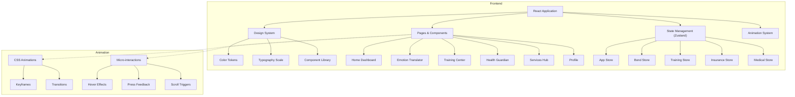

## 1. Architecture Design


## 2. Technology Description
- **Frontend**: React@18 + TypeScript + Vite
- **Styling**: Tailwind CSS@3 with custom design tokens
- **Icons**: Lucide React
- **State Management**: Zustand
- **Animations**: CSS Keyframes + React Transition Patterns
- **Build Tool**: Vite
- **Package Manager**: npm (pnpm fallback)

## 3. Route Definitions
| Route | Purpose |
|-------|---------|
| / | Home Dashboard with bond score & quick actions |
| /translator | Emotion translator & voice recording |
| /training | Training courses & progress tracking |
| /health | Health monitoring & alerts |
| /services | Services hub (insurance + medical) |
| /insurance | Insurance plans & policy management |
| /medical | Medical consultation & symptom checker |
| /profile | Pet profile & achievements |

## 4. Design System Architecture

### 4.1 Design Tokens
```typescript
// Color Palette
const colors = {
  primary: {
    50: '#FFF7F0',
    100: '#FFEBD8',
    200: '#FFD3AB',
    300: '#FFB473',
    400: '#FF8E3D',
    500: '#FF6B00',
    600: '#E85800',
    700: '#BF4500',
    800: '#993700',
    900: '#7D2E00',
  },
  secondary: {
    50: '#F0F9FF',
    100: '#D8EEFC',
    200: '#ABDCF9',
    300: '#73C6F3',
    400: '#3DAEEC',
    500: '#0E9CE5',
    600: '#0C80C7',
    700: '#0A659E',
    800: '#08507F',
    900: '#074167',
  },
  success: {
    50: '#F0FDF4',
    100: '#D8F9E3',
    200: '#ABF2C7',
    300: '#73E6A3',
    400: '#3DD87C',
    500: '#10B981',
    600: '#059669',
    700: '#047857',
    800: '#065F46',
    900: '#064E3B',
  },
  warning: {
    50: '#FFFBEB',
    100: '#FEF3C7',
    200: '#FDE68A',
    300: '#FCD34D',
    400: '#FBBF24',
    500: '#F59E0B',
    600: '#D97706',
    700: '#B45309',
    800: '#92400E',
    900: '#78350F',
  },
  danger: {
    50: '#FEF2F2',
    100: '#FEE2E2',
    200: '#FECACA',
    300: '#FCA5A5',
    400: '#F87171',
    500: '#EF4444',
    600: '#DC2626',
    700: '#B91C1C',
    800: '#991B1B',
    900: '#7F1D1D',
  },
  purple: {
    50: '#F5F3FF',
    100: '#EDE9FE',
    200: '#DDD6FE',
    300: '#C4B5FD',
    400: '#A78BFA',
    500: '#8B5CF6',
    600: '#7C3AED',
    700: '#6D28D9',
    800: '#5B21B6',
    900: '#4C1D95',
  },
  neutral: {
    50: '#F9FAFB',
    100: '#F3F4F6',
    200: '#E5E7EB',
    300: '#D1D5DB',
    400: '#9CA3AF',
    500: '#6B7280',
    600: '#4B5563',
    700: '#374151',
    800: '#1F2937',
    900: '#111827',
  }
}

// Typography Scale
const typography = {
  display: 'text-3xl font-bold tracking-tight',
  h1: 'text-2xl font-bold',
  h2: 'text-xl font-semibold',
  h3: 'text-lg font-semibold',
  body: 'text-base',
  small: 'text-sm',
  caption: 'text-xs',
}

// Spacing Scale (4px increments)
const spacing = {
  xs: '0.25rem',
  sm: '0.5rem',
  md: '1rem',
  lg: '1.5rem',
  xl: '2rem',
  '2xl': '3rem',
}

// Border Radius Scale
const borderRadius = {
  sm: '0.5rem',
  md: '0.75rem',
  lg: '1rem',
  xl: '1.5rem',
  '2xl': '2rem',
  full: '9999px',
}
```

### 4.2 Animation System
```typescript
// Animation Keyframes
const animations = {
  fadeIn: `
    @keyframes fadeIn {
      from { opacity: 0; }
      to { opacity: 1; }
    }
  `,
  slideUp: `
    @keyframes slideUp {
      from { 
        opacity: 0; 
        transform: translateY(20px); 
      }
      to { 
        opacity: 1; 
        transform: translateY(0); 
      }
    }
  `,
  scaleIn: `
    @keyframes scaleIn {
      from { 
        opacity: 0; 
        transform: scale(0.95); 
      }
      to { 
        opacity: 1; 
        transform: scale(1); 
      }
    }
  `,
  pulse: `
    @keyframes pulse {
      0%, 100% { 
        opacity: 1; 
        transform: scale(1); 
      }
      50% { 
        opacity: 0.8; 
        transform: scale(1.05); 
      }
    }
  `,
  breathe: `
    @keyframes breathe {
      0%, 100% { 
        transform: scale(1); 
      }
      50% { 
        transform: scale(1.03); 
      }
    }
  `,
  ripple: `
    @keyframes ripple {
      0% { 
        transform: scale(0.8); 
        opacity: 1; 
      }
      100% { 
        transform: scale(2.5); 
        opacity: 0; 
      }
    }
  `,
  shimmer: `
    @keyframes shimmer {
      0% { 
        background-position: -200% 0; 
      }
      100% { 
        background-position: 200% 0; 
      }
    }
  `
}

// Easing Functions
const easing = {
  easeOutCubic: 'cubic-bezier(0.22, 0.61, 0.36, 1)',
  easeOutBack: 'cubic-bezier(0.34, 1.56, 0.64, 1)',
  easeOutElastic: 'cubic-bezier(0.5, 1.5, 0.5, 1)',
}
```

### 4.3 Component Architecture
```typescript
// Base Card Component
interface CardProps {
  variant?: 'default' | 'gradient' | 'outlined' | 'elevated'
  padding?: 'none' | 'sm' | 'md' | 'lg' | 'xl'
  hover?: boolean
  children: React.ReactNode
  className?: string
}

// Button Component
interface ButtonProps {
  variant?: 'primary' | 'secondary' | 'outline' | 'ghost'
  size?: 'sm' | 'md' | 'lg' | 'xl'
  fullWidth?: boolean
  loading?: boolean
  icon?: React.ReactNode
  children: React.ReactNode
  className?: string
  onClick?: () => void
}

// Badge Component
interface BadgeProps {
  variant?: 'default' | 'primary' | 'success' | 'warning' | 'danger'
  size?: 'sm' | 'md' | 'lg'
  children: React.ReactNode
}

// Progress Ring Component
interface ProgressRingProps {
  progress: number
  size?: number
  strokeWidth?: number
  color?: string
  showValue?: boolean
  label?: string
}
```

## 5. State Management (Zustand Stores)

### 5.1 App Store
- Authentication state
- Current pet profile
- Navigation state
- UI preferences

### 5.2 Bond Store
- Bond score metrics (understanding, companionship, care, growth)
- Daily activities log
- Badges and achievements
- Total points
- Streak tracking

### 5.3 Training Store
- Training courses
- Current session
- Progress tracking
- Training records
- Statistics

### 5.4 Insurance Store
- Insurance plans
- User policies
- Claims history
- Selected plan

### 5.5 Medical Store
- Symptoms list
- Consultation history
- Appointments
- Medical records

## 6. Animation Patterns

### 6.1 Page Transitions
```typescript
// Staggered reveal for page elements
const staggeredDelay = (index: number) => `${index * 50}ms`
```

### 6.2 Card Animations
- Hover: translateY(-2px), shadow-lg
- Press: scale(0.97)
- Enter: slideUp + fadeIn (300ms)

### 6.3 Progress Animations
- SVG circle stroke-dashoffset
- Smooth transition over 1.5 seconds
- Ease-out cubic timing

### 6.4 Button Interactions
- Tap: scale 0.97
- Release: scale 1.03 then 1
- Ripple effect from center
- Shadow change on hover

## 7. Performance Optimizations
- CSS will-change for animated properties
- transform: translateZ(0) for GPU acceleration
- Virtual lists for long content
- Debounced scroll handlers
- Lazy loading components
- SVG icon optimization
