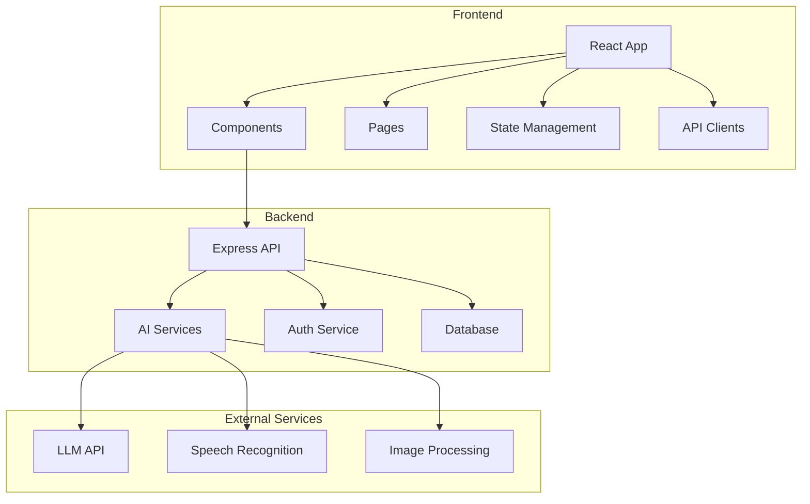
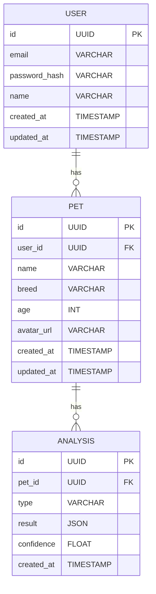

## 1. Architecture Design


## 2. Technology Description
- Frontend: React@18 + TypeScript + TailwindCSS@3 + Vite
- Backend: Express@4 + TypeScript
- Database: SQLite (development) / PostgreSQL (production)
- State Management: Zustand
- Routing: React Router DOM
- Icons: Lucide React
- Audio: Web Audio API
- Image: Canvas API

## 3. Route Definitions
| Route | Purpose | Component |
|-------|---------|-----------|
| / | Home dashboard | HomePage |
| /translator | AI voice translator | TranslatorPage |
| /health | Health monitoring | HealthPage |
| /profile | Pet profile | ProfilePage |
| /settings | App settings | SettingsPage |

## 4. API Definitions

### 4.1 Auth Endpoints
| Method | Endpoint | Purpose |
|--------|----------|---------|
| POST | /api/auth/register | Register new user |
| POST | /api/auth/login | Login user |
| GET | /api/auth/me | Get current user |

### 4.2 Pet Endpoints
| Method | Endpoint | Purpose |
|--------|----------|---------|
| GET | /api/pets | Get user's pets |
| POST | /api/pets | Create new pet profile |
| GET | /api/pets/:id | Get pet details |
| PUT | /api/pets/:id | Update pet profile |
| DELETE | /api/pets/:id | Delete pet |

### 4.3 Analysis Endpoints
| Method | Endpoint | Purpose |
|--------|----------|---------|
| POST | /api/analyze/voice | Analyze voice emotion |
| POST | /api/analyze/image | Analyze image |
| GET | /api/analyze/history | Get analysis history |

## 5. Data Model

### 5.1 ER Diagram


### 5.2 DDL Statements
```sql
CREATE TABLE users (
    id TEXT PRIMARY KEY,
    email TEXT UNIQUE NOT NULL,
    password_hash TEXT NOT NULL,
    name TEXT,
    created_at TIMESTAMP DEFAULT CURRENT_TIMESTAMP,
    updated_at TIMESTAMP DEFAULT CURRENT_TIMESTAMP
);

CREATE TABLE pets (
    id TEXT PRIMARY KEY,
    user_id TEXT REFERENCES users(id),
    name TEXT NOT NULL,
    breed TEXT,
    age INTEGER,
    avatar_url TEXT,
    created_at TIMESTAMP DEFAULT CURRENT_TIMESTAMP,
    updated_at TIMESTAMP DEFAULT CURRENT_TIMESTAMP
);

CREATE TABLE analyses (
    id TEXT PRIMARY KEY,
    pet_id TEXT REFERENCES pets(id),
    type TEXT NOT NULL,
    result TEXT NOT NULL,
    confidence REAL,
    created_at TIMESTAMP DEFAULT CURRENT_TIMESTAMP
);
```

## 6. Security Considerations
- JWT authentication with refresh tokens
- Password hashing with bcrypt
- HTTPS only
- CORS configuration
- Rate limiting
- Input validation
- Sensitive data encryption

## 7. Performance Requirements
- Emotion translation response < 2 seconds
- Health anomaly detection < 1 second
- Optimized for mobile with lazy loading
- Caching strategy for frequent requests